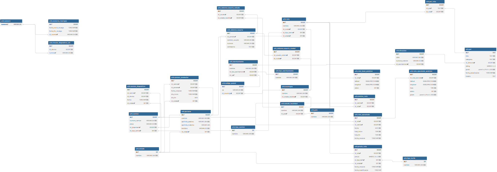

# Modelo de Base de Datos

Diagrama interactivo (dbdiagram.io): https://dbdiagram.io/d/6995c999bd82f5fce2128071

## Diagrama (SVG)

## Excplicacion de campos logicos 
Tabla: urb.estado
Campo:Nombre
Uso: Cualquier tabla que tenga una llave foranea a esta tabla significa que sus registro pueden estar activos, inactivos o pendientes entre otros.
