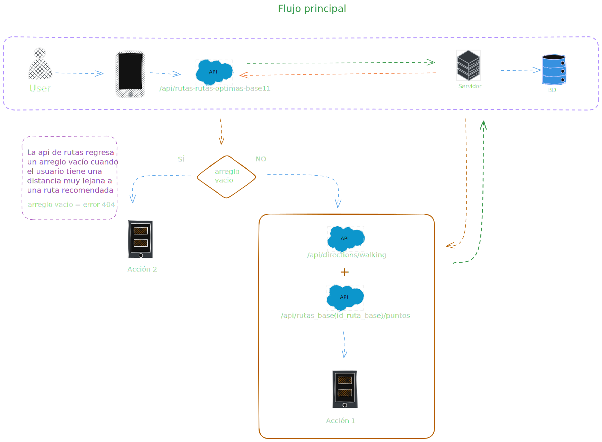
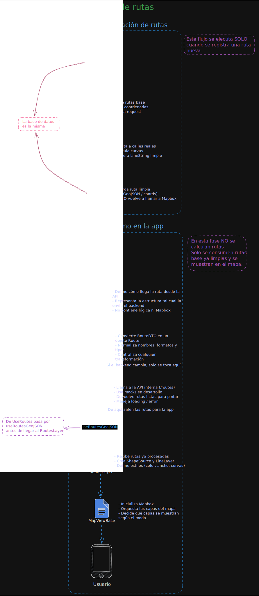
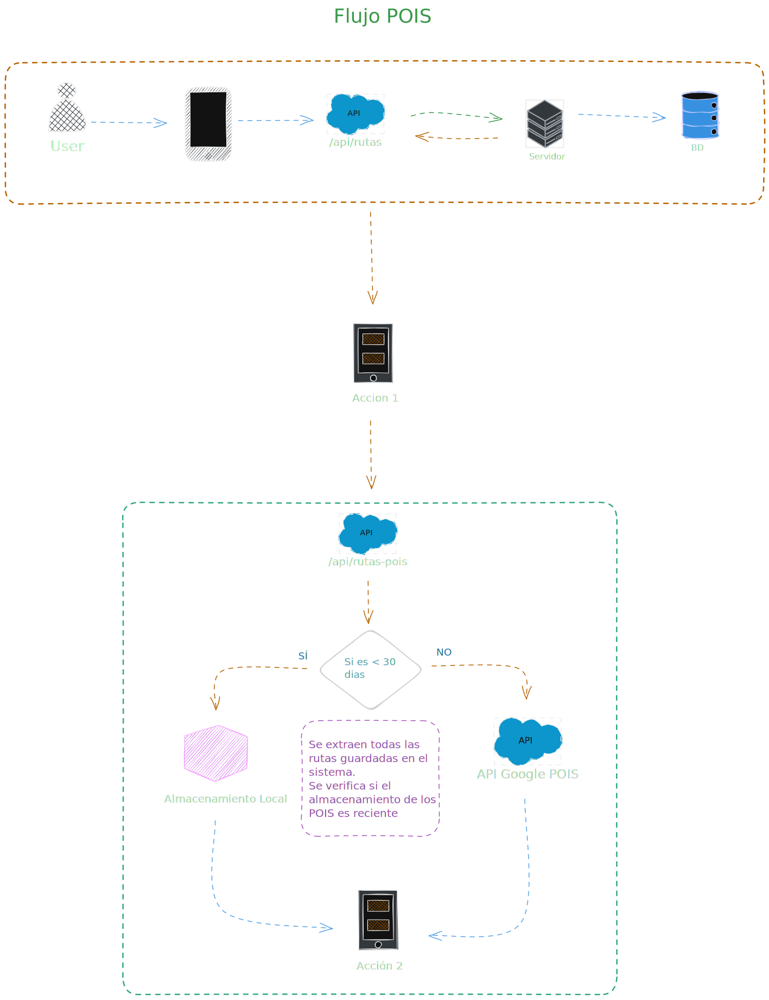
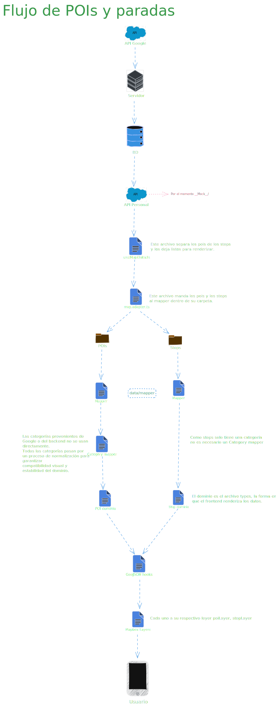

## Flujo de Datos

### Flujo Principal
<picture>
  <source media="(prefers-color-scheme: dark)" srcset="./flujo_principal_dark.svg">
  
</picture>

### Flujo de Rutas
<picture>
  <source media="(prefers-color-scheme: dark)" srcset="./flujo_ruta_dark.svg">
  
</picture>

### Flujo de POIs
<picture>
  <source media="(prefers-color-scheme: dark)" srcset="./flujo_poi_dark.svg">
  
</picture>

### Flujo de POIs y Paradas
<picture>
  <source media="(prefers-color-scheme: dark)" srcset="./flujo_poi_paradas_dark.svg">
  
</picture>
